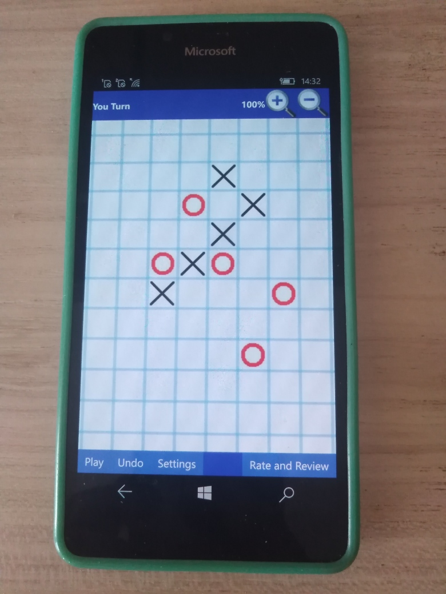

# Gomoku 9.10 - master branch 

Reversed "Gomoku (x86/x64 only)", fun game project by eyacker. :) 

My goal was to archieve (build) Gomoku ARM (micro-gameversion for old sweet Windows-Phones). No less, no more :)

## About (Description)

Gomoku is a challenging strategy board game and is also called Five in a Row or Gobang. 
The winner is the first player to get an unbroken row of five stones horizontally, vertically, or diagonally.

PLAY GOMOKU AGAINST THE COMPUTER =) HELLO, AI ;)

## FEATURES (Partially recovered at now):
• STRONGEST ARTFICIAL INTELLIGENCE ENGINE on the Windows Store (under continuous development)
• SCALABLE Artificial Intelliegence Engine with five selectable difficulty modes from very easy to very hard
• Six COOL SKINS
• Play games with your friends in the two player mode
• Easy to use interface
• You can play Gomoku in a small, medium and large table
• Scrollable and resizeable tables
• Zoom in and out
• Undo
• Autosave/Autoload game state
• Windows 11, Windows 10 and Windows 10 Mobile are supported

## WHAT users say about Gomoku:
- "Its a very good game. You can play against your phone or with your friends. Nice boards!"
- "Its a good game! I wish we will receive more good and cool game from this dev ;-)"
- "FUN :)"
- "BEST GAME!! Good looking and cool :-D Ex

## Screenshots

## My 2 cents
-  WP8 -> UWP
- Min. Win. SDK = 10240 

## TODO
- Fix sound problem
- Fix Settings
- Repair load/save game data

## .
As is. No support. DIY. Learn purposes only.

## Reference(s)
- https://apps.microsoft.com/detail/9wzdncrd2qlm Gooku in Microsoft Store
- http://www.eyacker.com/ Developer of original Gomoku

## ..
[m][e] July, 3 2025

